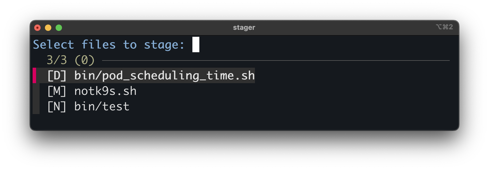

# stager
🌀 A lightweight CLI tool to interactively stage Git changes using fzf. Quickly pick and stage modified, new, or deleted files with visual context—no more git add guesswork.



> ⚠️ `stager` only works at the file level. Use `git add -p` if you want to stage specific lines.


## ⚡ Quick Setup

To use `stager` anywhere, add this to your shell profile:
```bash
alias stager="/full/path/to/stager.sh"
````

---

## 📄 License

This project is licensed under the [MIT License](LICENSE).